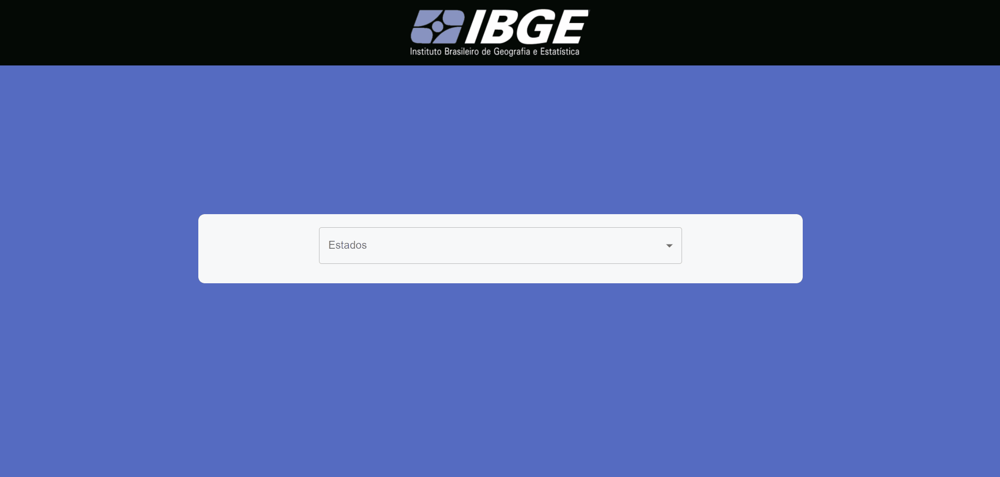

# projetoDesafioIPAM

  

### - Este projeto é um desafio de uma SPA que faz requisição à API do IBGE e retorna um card do município, informando a microrregião, mesorregião, uf e a região.

### - Nesta aplicação foram usados as seguintes tecnologias:

#### *React JS
#### *Redux
#### *Styled-Component
#### *Material UI

### Demonstração da aplicação

### Como visualizar aplicação em sua máquina:

#### 1º Passo: Instale o git, veja o passo a passo em https://git-scm.com/downloads
#### 2º Passo: Instale o node, veja o passo a passo em https://nodejs.org/en/download/
#### 3º Passo: Abra o terminal como administrador e execute o comando: ' git clone https://github.com/andrealvesz/projetoDesafioIPAM.git '
#### 4º Passo: Digite o comando ' cd projetoDesafioIPAM ' para acessar o diretório do projeto
#### 5º Passo: Digite o comando ' yarn ' e ao finalizar, digite o comando ' yarn dev '

### Gostou do meu projeto!? :D Entre em contato comigo! 
[Linkedin](https://www.linkedin.com/in/andrealves7/)  
[Email: andrealvesdev@gmail.com](mailto:andrealvesdev@gmail.com)
